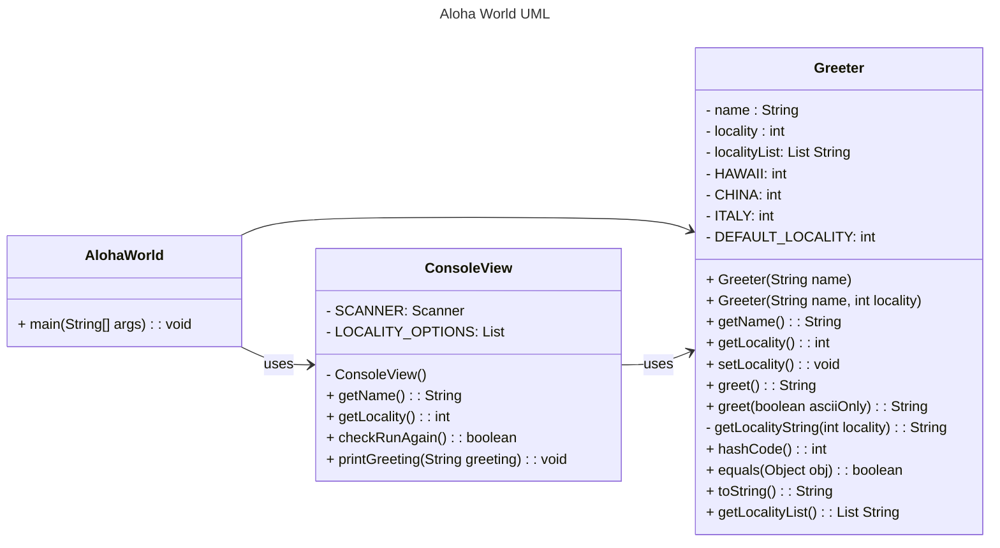

# Homework Aloha World Report

The following report contains questions you need to answer as part of your submission for the homework assignment. 

## Design Doc
Please link your UML design file here. See resources in the assignment on how to
link an image in markdown. You may also use [mermaid] class diagrams if you prefer, if so, include the mermaid code here.  You DO NOT have to include Greeting.java as part of the diagram, just the AlohaWorld application that includes: [AlohaWorld.java], [Greeter.java], and [ConsoleView.java].

### Program Flow
Write a short paragraph detailing the flow of the program in your own words. This is to help you understand / trace the code (and give you practice of something called a code walk that will be required in this course).
> AlohaWorld is the driver of the program, which contains only the main method. Within the main method, it calls static methods in consoleView to interact with users. For example taking in user inputs and print out the messages. 
> 
> In AlohaWorld main method, it also creates a Greeter object, where Greeter class stores data of localityList, localityID, and has methods that process formatted greet message that consoleView can access and print out. 

## Assignment Questions

1. List three additional java syntax items you didn't know when reading the code.  (make sure to use * for the list items, see example below, the backtick marks are used to write code inline with markdown)

   * `Integer.parseInt(input)`
   * `String.format()`
   * `instanceof`

2. For each syntax additional item listed above, explain what it does in your own words and then link a resource where you figured out what it does in the references section.
    * `Integer.parseInt(input)` is used to convert a String into an int. For example: `String input = "50"` `int result = Integer.parseInt(input)`, the result will be 50 in integer.[^1]
    * `String.format()` is used to create a formatted string using the specified format string and arguments. Placeholders like `%d` (for integers), `%s` (for strings), and `%f` (for float) are replaced with actual values.[^2]
    * `instanceof` is a keyword used to check if an object is an instance of a specific class or subclass. It returns true if the object is of the specified type and false otherwise. This is especially useful for type-checking in polymorphism or casting safely.[^3]

3. What does `main` do in Java? 

   The main method is the entry point for a Java application. It is where the program begins execution.

4. What does `toString()` do in Java? Why should any object class you create have a `toString()` method?

   It creates a string representation of an object, we can customize how we want the object is described. Usually used for debugging and print meaningful information about the object.

5. What is javadoc style commenting? What is it used for? 

   The javadoc style comments start with /** and describe classes, methods, or fields. It's used to generate documentation for Java programs.

6. Describe Test Driving Development (TDD) in your own words. 

    It's a software development process that writes tests before implementing the code. This process would help having fewer bugs.

7. Go to the [Markdown Playground](MarkdownPlayground.md) and add at least 3 different markdown elements you learned about by reading the markdown resources listed in the document. Additionally you need to add a mermaid class diagram (of your choice does not have to follow the assignment. However, if you did use mermaid for the assignment, you can just copy that there). Add the elements into the markdown file, so that the formatting changes are reserved to that file. 

## Deeper Thinking Questions

These questions require deeper thinking of the topic. We don't expect 100% correct answers, but we encourage you to think deeply and come up with a reasonable answer. 

1. Why would we want to keep interaction with the client contained to ConsoleView?

2. Right now, the application isn't very dynamic in that it can be difficult to add new languages and greetings without modifying the code every time. Just thinking programmatically,  how could you make the application more dynamic? You are free to reference Geeting.java and how that could be used in your design.

> [!IMPORTANT]
>  After you upload the files to your github (ideally you have been committing throughout this progress / after you answer every question) - make sure to look at your completed assignment on github/in the browser! You can make sure images are showing up/formatting is correct, etc. The TAs will actually look at your assignment on github, so it is important that it is formatted correctly.

## References

[^1]: Oracle Docs: Integer.parseInt(). https://docs.oracle.com/javase/8/docs/api/java/lang/Integer.html#parseInt-java.lang.String-. Accessed: 2025-01-24. 

[^2]: Oracle Docs: String.format(). https://docs.oracle.com/javase/8/docs/api/java/lang/String.html#format-java.lang.String-java.lang.Object...-. Accessed: 2025-01-24.

[^3]: Oracle Docs: instanceof. https://docs.oracle.com/javase/specs/jls/se8/html/jls-15.html#jls-15.20.2. Accessed: 2025-01-24.

<!-- This is a comment, below this link the links in the document are placed here to make it easier to read. This is an optional style for markdown, and often as a student you will include the links inline. for example [mermaid](https://mermaid.js.org/intro/syntax-reference.html) -->
[mermaid]: https://mermaid.js.org/intro/syntax-reference.html
[AlohaWorld.java]: src/main/java/student/AlohaWorld.java
[Greeter.java]: src/main/java/student/Greeter.java
[ConsoleView.java]: src/main/java/student/ConsoleView.java